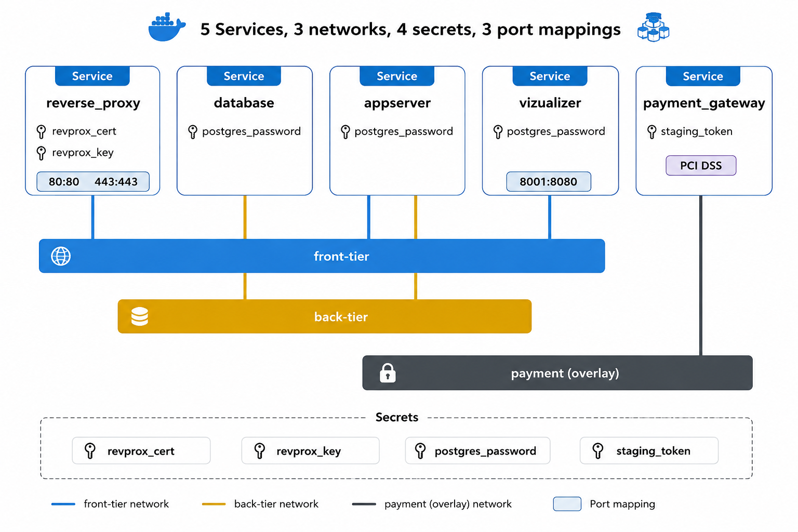
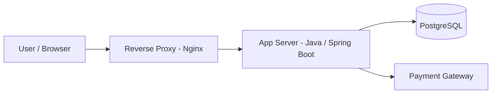

# AtSea Sample Shop App

A full-stack e-commerce sample application containerized with Docker for local development and Docker Swarm for clustered deployment. This repository demonstrates how to package a React frontend, a Java/Spring Boot backend, a PostgreSQL database, an Nginx reverse proxy, and a payment gateway simulation into a production-style containerized architecture.



The project is designed to show:
- how to build and run multi-service applications with Docker Compose
- how to deploy the same stack on Docker Swarm using services, secrets, networks, and placement constraints
- how to containerize frontend, backend, database, and networking layers in a clean and maintainable way

---

## 1. Project Overview

AtSea is a sample online shop application with the following components:

- Frontend: React application served as a static build inside the application container
- Backend: Java application built with Maven and packaged as a Spring Boot JAR
- Database: PostgreSQL instance initialized with custom startup scripts
- Reverse Proxy: Nginx service handling routing and TLS termination
- Payment Gateway: a lightweight mock service that reads a Docker secret and simulates payment processing

This repository contains both development-oriented and production-oriented deployment setups.

---

## 2. Repository Structure

- [app](app) – full application source code and multi-stage Docker build context
- [app/Dockerfile](app/Dockerfile) – Dockerfile for building the full application image
- [database](database) – PostgreSQL image assets and initialization scripts
- [database/Dockerfile](database/Dockerfile) – PostgreSQL container definition
- [reverse_proxy](reverse_proxy) – Nginx configuration and image definition
- [payment_gateway](payment_gateway) – mock payment service and its Dockerfile
- [docker-compose.yml](docker-compose.yml) – local development stack using Docker Compose
- [docker-stack.yml](docker-stack.yml) – Docker Swarm stack definition for cluster deployment
- [build_docker_images.sh](build_docker_images.sh) – builds and pushes Docker images to a registry
- [create_docker_secrets.sh](create_docker_secrets.sh) – creates Docker secrets for Compose/Swarm use
- [delete_docker_resources.sh](delete_docker_resources.sh) – cleans Docker containers, images, and build cache
- [devsecrets](devsecrets) – local secret files used by Compose

---

## 3. Architecture Diagram



The traffic flow is simple and layered:
1. The browser reaches the reverse proxy.
2. Nginx forwards requests to the application server.
3. The application connects to PostgreSQL for data persistence.
4. Payment-related logic is isolated through the payment gateway service.

---

## 4. Docker Compose Setup (Local Development)

Docker Compose is used here for local testing and fast iteration. It builds images from the local source tree and uses local secret files.

### Prerequisites

Make sure Docker and Docker Compose are installed and running:

```bash
docker --version
docker compose version
```

### Start the stack locally

```bash
docker compose up --build
```

This command will:
- build the application images from local Dockerfiles
- create the required networks
- mount the secret files for local development
- start the reverse proxy, database, application service, and payment gateway

### Stop the stack

```bash
docker compose down
```

### What each service does in Compose

- [docker-compose.yml](docker-compose.yml)
  - reverse_proxy: exposes ports 80 and 443 and routes traffic to the app server
  - database: runs PostgreSQL and uses the secret file for the database password
  - appserver: runs the Java backend and exposes port 8080 for local access
  - payment_gateway: runs the mock payment service and uses a payment token secret

---

## 5. Dockerfiles Explained

Each service has its own Dockerfile, and the project uses a multi-stage build approach for the main application image.

### [app/Dockerfile](app/Dockerfile)

This is the most complex Dockerfile in the repository. It uses three build stages:

1. Frontend build stage
   - uses Node.js Alpine
   - installs React dependencies
   - builds the React web app

2. Backend build stage
   - uses Maven with Java 8
   - resolves dependencies and packages the Java application

3. Runtime stage
   - uses a lightweight Java runtime image
   - copies the built frontend assets and the packaged Spring Boot JAR
   - runs the application with the PostgreSQL profile

This design keeps the final image lean while still building the frontend and backend in a controlled environment.

### [database/Dockerfile](database/Dockerfile)

This image is based on PostgreSQL 9.6 and copies:
- initialization SQL scripts
- PostgreSQL configuration files
- default environment settings

It is designed to bootstrap the database automatically when the container starts.

### [reverse_proxy/Dockerfile](reverse_proxy/Dockerfile)

This image is based on Nginx Alpine and copies the custom Nginx configuration into the container.

### [payment_gateway/Dockerfile](payment_gateway/Dockerfile)

This is a lightweight Alpine-based container that runs the payment gateway script inside the app directory.

---

## 6. Scripts in This Repository

### [build_docker_images.sh](build_docker_images.sh)

This script builds Docker images for each service and pushes them to Docker Hub using the following tags:

- zaher2004/atsea-appserver:v1.0
- zaher2004/atsea-database:v1.0
- zaher2004/atsea-reverse-proxy:v1.0
- zaher2004/atsea-paymentgateway:v1.0

It is useful when you want to publish your images for use in a cluster or remote environment.

### [create_docker_secrets.sh](create_docker_secrets.sh)

This script creates Docker secrets required by the stack. It generates:
- a TLS certificate secret for the reverse proxy
- a TLS private key secret
- a PostgreSQL password secret
- a staging token secret for the payment gateway

In development, this is convenient. In production, you should replace the sample values with real, secure secrets.

### [delete_docker_resources.sh](delete_docker_resources.sh)

This script removes containers, images, and Docker build cache so you can fully reset the environment.

---

## 7. Docker Swarm Deployment

Docker Swarm is used here to show how the same application can be deployed as a cluster-oriented stack.

### Why Swarm?

Swarm is ideal for:
- running multiple replicas of services
- managing service updates with rollback behavior
- isolating workloads with overlay networks
- using Docker secrets securely across services
- placing services on specific nodes based on labels or role

### Swarm stack file

The stack definition lives in [docker-stack.yml](docker-stack.yml).

It includes:
- service definitions for reverse_proxy, database, appserver, payment_gateway, and visualizer
- overlay networks for frontend, backend, and payment isolation
- Docker secrets references instead of local files
- placement constraints such as running the database on worker nodes and the visualizer on a manager node
- rollback policy for updates

### Deploy the stack

Before deploying, make sure Docker Swarm is initialized on your host or cluster:

```bash
docker swarm init
```

Then create the required secrets:

```bash
./create_docker_secrets.sh
```

Finally deploy the stack:

```bash
docker stack deploy -c docker-stack.yml atsea
```

### Verify the deployment

```bash
docker service ls
docker stack ps atsea
```

### Important Swarm concepts used here

- Services: each containerized component is managed as a Docker service
- Replicas: the app server is deployed with multiple replicas
- Update configuration: failures trigger rollback
- Placement constraints: services are pinned to specific node roles or labels
- Secrets: sensitive values are injected securely into containers
- Networks: services are separated into logical network tiers

---

## 8. Networking and Secrets

The repository uses multiple networks to logically isolate components:

- front-tier: for public-facing services such as the reverse proxy and app server
- back-tier: for internal database access
- payment: for payment-related communication and stricter isolation

The swarm configuration also uses encrypted overlay networking for the payment network to improve isolation.

Secrets are used for:
- PostgreSQL password
- TLS certificate and private key
- payment token

This is more secure than embedding credentials directly in images or Compose files.

---

## 9. How the Reverse Proxy Works

The reverse proxy is configured in [reverse_proxy/nginx.conf](reverse_proxy/nginx.conf).

Key details:
- it listens on port 80 and redirects to HTTPS
- it terminates TLS using secrets mounted into the container
- it forwards requests to the application service over the internal Docker network

The proxy is a critical layer for production-style deployments because it centralizes request handling and hides internal service complexity from the outside world.

---

## 10. Running the Payment Gateway

The payment gateway is a simple mock service implemented in [payment_gateway/process.sh](payment_gateway/process.sh).

It reads the payment token from a Docker secret and prints whether the service is in staging or production mode. This is a safe way to simulate a real payment dependency without exposing sensitive credentials.

---

## 11. Troubleshooting

### Containers do not start

Check the logs:

```bash
docker compose logs
docker service logs <service_name>
```

### Database connection issues

Verify that the database container is healthy and that the app server can reach it through the Docker network.

### Secrets not found

If the stack fails due to missing secrets, recreate them using the provided script or create them manually with Docker CLI commands.

### Images fail to build

Make sure the Docker build context is correct and that the required files exist in the repository folders.

---

## 12. Production Notes

For a real production deployment, consider the following improvements:
- use real certificates from a trusted CA instead of self-signed ones
- store secrets in a proper external secret manager if available
- use private registries instead of public Docker Hub images
- run the database with persistent storage
- configure health checks and monitoring for each service
- use environment-specific configuration files instead of hardcoded values

---

## 13. Quick Start Summary

If you want to run the project quickly:

```bash
docker compose up --build
```

If you want to deploy it in a Docker Swarm cluster:

```bash
./create_docker_secrets.sh
./build_docker_images.sh
docker stack deploy -c docker-stack.yml atsea
```

This repository is a practical example of how to combine Docker, Compose, Dockerfiles, scripts, and Swarm into a modern containerized application workflow.

